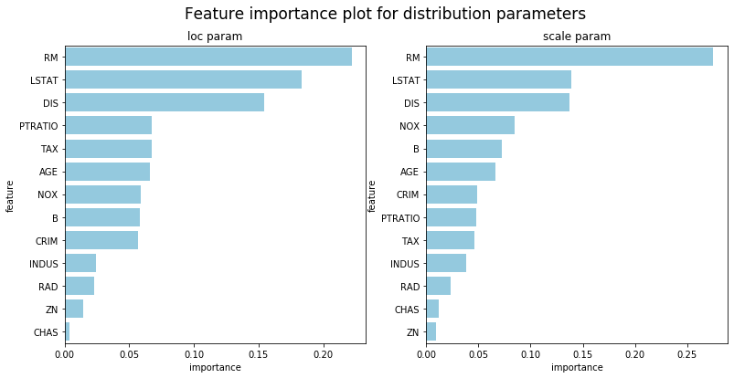
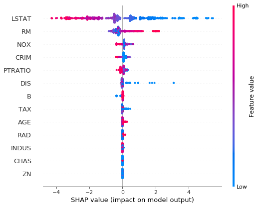

# NGBoost: Natural Gradient Boosting for Probabilistic Prediction

ngboost is a Python library that implements Natural Gradient Boosting, as described in ["NGBoost: Natural Gradient Boosting for Probabilistic Prediction"](https://stanfordmlgroup.github.io/projects/ngboost/). It is built on top of [Scikit-Learn](https://scikit-learn.org/stable/), and is designed to be scalable and modular with respect to choice of proper scoring rule, distribution, and base learners.

Installation:

```
pip install --upgrade git+https://github.com/stanfordmlgroup/ngboost.git
```

## Basic Usage

Probabilistic regression example on the Boston housing dataset:


```python
from ngboost import NGBRegressor

from sklearn.datasets import load_boston
from sklearn.model_selection import train_test_split
from sklearn.metrics import mean_squared_error

X, Y = load_boston(True)
X_train, X_test, Y_train, Y_test = train_test_split(X, Y, test_size=0.2)

ngb = NGBRegressor().fit(X_train, Y_train)
Y_preds = ngb.predict(X_test)
Y_dists = ngb.pred_dist(X_test)

# test Mean Squared Error
test_MSE = mean_squared_error(Y_preds, Y_test)
print('Test MSE', test_MSE)

# test Negative Log Likelihood
test_NLL = -Y_dists.logpdf(Y_test).mean()
print('Test NLL', test_NLL)
```

    [iter 0] loss=3.6128 val_loss=0.0000 scale=0.5000 norm=3.2691
    [iter 100] loss=3.0357 val_loss=0.0000 scale=1.0000 norm=3.6034
    [iter 200] loss=2.4001 val_loss=0.0000 scale=2.0000 norm=3.9060
    [iter 300] loss=1.9981 val_loss=0.0000 scale=2.0000 norm=3.1249
    [iter 400] loss=1.8309 val_loss=0.0000 scale=1.0000 norm=1.4197
    Test MSE 9.450432146235272
    Test NLL 3.303289090299992


Getting the estimated distributional parameters at a set of points is easy. This returns the predicted mean and standard deviation of the first five observations in the test set:


```python
Y_dists[0:5].params
```


    {'loc': array([30.54956664,  8.64553738, 46.01648903, 24.46352698, 10.68025714]),
     'scale': array([1.60925628, 1.89496288, 1.98933813, 1.7326905 , 1.46499187])}


### Distributions

NGBoost can be used with a variety of distributions, broken down into those for regression (support on an infinite set) and those for classification (support on a finite set).

#### Regression Distributions

| Distribution | Parameters | Implemented Scores | Reference |
| --- | --- | --- | --- |
| `Normal` | `loc`, `scale` | `LogScore`, `CRPScore` | [`scipy.stats` normal](https://docs.scipy.org/doc/scipy/reference/generated/scipy.stats.norm.html) |
| `LogNormal` | `s`, `scale` | `LogScore`, `CRPScore` | [`scipy.stats` lognormal](https://docs.scipy.org/doc/scipy/reference/generated/scipy.stats.lognorm.html) |
| `Exponential` | `scale` | `LogScore`, `CRPScore` | [`scipy.stats` exponential](https://docs.scipy.org/doc/scipy/reference/generated/scipy.stats.expon.html) |

Regression distributions can be used through the `NGBRegressor()` constructor by passing the appropriate class as the `Dist` argument. `Normal` is the default.


```python
from ngboost.distns import Exponential, Normal

X, Y = load_boston(True)
X_reg_train, X_reg_test, Y_reg_train, Y_reg_test = train_test_split(X, Y, test_size=0.2)

ngb_norm = NGBRegressor(Dist=Normal, verbose=False).fit(X_reg_train, Y_reg_train)
ngb_exp = NGBRegressor(Dist=Exponential, verbose=False).fit(X_reg_train, Y_reg_train)
```

There are two prediction methods for `NGBRegressor` objects: `predict()`, which returns point predictions as one would expect from a standard regressor, and `pred_dist()`, which returns a distribution object representing the conditional distribution of $Y|X=x_i$ at the points $x_i$ in the test set.


```python
ngb_exp.predict(X_reg_test)[0:5]
```


    array([ 9.22263926, 15.70776158, 20.60907799, 20.97809868, 26.93619437])


```python
ngb_exp.pred_dist(X_reg_test)[0:5].params
```


    {'scale': array([ 9.22263926, 15.70776158, 20.60907799, 20.97809868, 26.93619437])}


##### Survival Regression

NGBoost supports analyses of right-censored data. Any distribution that can be used for regression in NGBoost can also be used for survival analysis in theory, but this requires the implementation of the right-censored version of the appropriate score. At the moment, `LogNormal` and `Exponential` have these scores implemented. To do survival analysis, use `NGBSurvival` and pass both the time-to-event (or censoring) and event indicator vectors to  `fit()`:

```python
import numpy as np
from ngboost import NGBSurvival
from ngboost.distns import LogNormal

X, Y = load_boston(True)
X_surv_train, X_surv_test, Y_surv_train, Y_surv_test = train_test_split(X, Y, test_size=0.2)

# introduce administrative censoring to simulate survival data
T_surv_train = np.minimum(Y_train, 30) # time of an event or censoring
E_surv_train = Y_train > 30 # 1 if T[i] is the time of an event, 0 if it's a time of censoring

ngb = NGBSurvival(Dist=LogNormal).fit(X_surv_train, T_surv_train, E_surv_train)
```

    [iter 0] loss=3.0387 val_loss=0.0000 scale=1.0000 norm=1.0247
    [iter 100] loss=2.8832 val_loss=0.0000 scale=1.0000 norm=0.6492
    [iter 200] loss=2.7676 val_loss=0.0000 scale=2.0000 norm=1.1651
    [iter 300] loss=2.6800 val_loss=0.0000 scale=1.0000 norm=0.5629
    [iter 400] loss=2.6094 val_loss=0.0000 scale=2.0000 norm=1.0975


#### Classification Distributions

| Distribution | Parameters | Implemented Scores | Reference |
| --- | --- | --- | --- |
| `k_categorical(K)` | `p0`, `p1`... `p{K-1}` | `LogScore` | [Categorical distribution on Wikipedia](https://en.wikipedia.org/wiki/Categorical_distribution) |
| `Bernoulli` | `p` | `LogScore` | [Bernoulli distribution on Wikipedia](https://en.wikipedia.org/wiki/Bernoulli_distribution) |

Classification distributions can be used through the `NGBClassifier()` constructor by passing the appropriate class as the `Dist` argument. `Bernoulli` is the default and is equivalent to `k_categorical(2)`.


```python
from ngboost import NGBClassifier
from ngboost.distns import k_categorical, Bernoulli
from sklearn.datasets import load_breast_cancer

X, y = load_breast_cancer(True)
y[0:15] = 2 # artificially make this a 3-class problem instead of a 2-class problem
X_cls_train, X_cls_test, Y_cls_train, Y_cls_test  = train_test_split(X, y, test_size=0.2)

ngb_cat = NGBClassifier(Dist=k_categorical(3), verbose=False) # tell ngboost that there are 3 possible outcomes
ngb_cat.fit(X_cls_train, Y_cls_train) # Y should have only 3 values: {0,1,2}
```

When using NGBoost for classification, the outcome vector `Y` must consist only of integers from 0 to K-1, where K is the total number of classes. This is consistent with the classification standards in sklearn.

`NGBClassifier` objects have three prediction methods: `predict()` returns the most likely class, `predict_proba()` returns the class probabilities, and `pred_dist()` returns the distribution object.


```python
ngb_cat.predict(X_cls_test)[0:5]
```


    array([1, 1, 1, 1, 1])


```python
ngb_cat.predict_proba(X_cls_test)[0:5]
```


    array([[6.50877928e-03, 9.93008762e-01, 4.82458738e-04],
           [6.50877928e-03, 9.93008762e-01, 4.82458738e-04],
           [6.99759965e-03, 9.92965014e-01, 3.73865663e-05],
           [4.36816914e-02, 9.56318303e-01, 5.92935593e-09],
           [6.50877928e-03, 9.93008762e-01, 4.82458738e-04]])


```python
ngb_cat.pred_dist(X_cls_test)[0:5].params
```


    {'p0': array([0.00650878, 0.00650878, 0.0069976 , 0.04368169, 0.00650878]),
     'p1': array([0.99300876, 0.99300876, 0.99296501, 0.9563183 , 0.99300876]),
     'p2': array([4.82458738e-04, 4.82458738e-04, 3.73865663e-05, 5.92935593e-09,
            4.82458738e-04])}


### Scores

NGBoost supports the log score (`LogScore`) and CRPS (`CRPScore`), although each score may not be implemented for each distribution. The score is specified by the `Score` argument in the constructor.


```python
from ngboost.scores import LogScore, CRPScore

NGBRegressor(Dist=Exponential, Score=CRPScore, verbose=False).fit(X_reg_train, Y_reg_train)
NGBClassifier(Dist=k_categorical(3), Score=LogScore, verbose=False).fit(X_cls_train, Y_cls_train)
```


### Base Learners

NGBoost can be used with any sklearn regressor as the base learner, specified with the `Base` argument. The default is a depth-3 regression tree.


```python
from sklearn.tree import DecisionTreeRegressor

learner = DecisionTreeRegressor(criterion='friedman_mse', max_depth=5)

NGBSurvival(Dist=Exponential, Score=CRPScore, Base=learner, verbose=False).fit(X_surv_train, T_surv_train, E_surv_train)
```

### Other Arguments

The learning rate, number of estimators, and minibatch fraction are also easily adjusted:


```python
NGBRegressor(n_estimators=100, learning_rate=0.01, minibatch_frac=0.5).fit(X_reg_train, Y_reg_train)
```

----

## Tuning

### Staged Prediction

All fit NGBoost objects support staged prediction.


```python
ngb_cls = NGBClassifier(Dist=k_categorical(3), Score=LogScore, n_estimators=500, verbose=False).fit(X_cls_train, Y_cls_train)
```

For instance, to get the predictions on the first 5 examples after fitting 415 base learners, use:


```python
preds = ngb_cls.staged_predict(X_cls_test)
preds[415][0:5]
```


    array([1, 1, 1, 1, 1])


```python
pred_dists = ngb_cls.staged_pred_dist(X_cls_test)
pred_dists[415][0:5].params
```


    {'p0': array([0.00650908, 0.00650908, 0.00699792, 0.04368125, 0.00650908]),
     'p1': array([0.99300844, 0.99300844, 0.99296469, 0.95631874, 0.99300844]),
     'p2': array([4.82481272e-04, 4.82481272e-04, 3.73882973e-05, 5.93165519e-09,
            4.82481272e-04])}


### Using `sklearn` Model Selection

`sklearn` methods are compatible with NGBoost.


```python
from sklearn.model_selection import GridSearchCV

b1 = DecisionTreeRegressor(criterion='friedman_mse', max_depth=2)
b2 = DecisionTreeRegressor(criterion='friedman_mse', max_depth=4)

param_grid = {
    'n_estimators': [20, 50],
    'minibatch_frac': [1.0, 0.5],
    'Base': [b1, b2]
}

ngb = NGBRegressor(Dist=Exponential, verbose=False)

grid_search = GridSearchCV(ngb, param_grid=param_grid, cv=5)
grid_search.fit(X_reg_train, Y_reg_train)
print(grid_search.best_params_)
```

    {'Base': DecisionTreeRegressor(criterion='friedman_mse', max_depth=2, max_features=None,
                          max_leaf_nodes=None, min_impurity_decrease=0.0,
                          min_impurity_split=None, min_samples_leaf=1,
                          min_samples_split=2, min_weight_fraction_leaf=0.0,
                          presort=False, random_state=None, splitter='best'), 'minibatch_frac': 0.5, 'n_estimators': 20}


---

## Model Interpretation

We caution users [against trying to interpret](https://www.google.com/search?q=mythos+of+interpretability&rlz=1C5CHFA_enUS831US831&oq=mythos+of+in&aqs=chrome.0.0j69i57j0l6.2088j0j7&sourceid=chrome&ie=UTF-8) too much from any machine learning model, but NGBoost does provide methods to interpret models fit with regression tree base learners. Since each parameter in the distribution is fit by a separate sequence of learners, there will be multiple model interpretation results, one for each parameter. The default distribution used is normal distribution so the following example shows results for the `loc` and `scale` parameters.

### Feature Importance


```python
ngb = NGBRegressor(verbose=False).fit(X_reg_train, Y_reg_train)

## Feature importance for loc trees
feature_importance_loc = ngb.feature_importances_[0]

## Feature importance for scale trees
feature_importance_scale = ngb.feature_importances_[1]
```


```python
import pandas as pd
import matplotlib.pyplot as plt
import seaborn as sns

df_loc = pd.DataFrame({'feature':load_boston()['feature_names'], 
                       'importance':feature_importance_loc})\
    .sort_values('importance',ascending=False)
df_scale = pd.DataFrame({'feature':load_boston()['feature_names'], 
                       'importance':feature_importance_scale})\
    .sort_values('importance',ascending=False)

fig, (ax1, ax2) = plt.subplots(1, 2, figsize=(13,6))
fig.suptitle("Feature importance plot for distribution parameters", fontsize=17)
sns.barplot(x='importance',y='feature',ax=ax1,data=df_loc, color="skyblue").set_title('loc param')
sns.barplot(x='importance',y='feature',ax=ax2,data=df_scale, color="skyblue").set_title('scale param')
```





### SHAP


```python
import shap
shap.initjs()

## SHAP plot for loc trees
explainer = shap.TreeExplainer(ngb, model_output=0) # use model_output = 1 for scale trees
shap_values = explainer.shap_values(X)
shap.summary_plot(shap_values, X, feature_names=load_boston()['feature_names'])
```





----

## Adding Functionality

As you work with NGBoost, you may want to experiment with distributions or scores that are not yet supported. Here we will walk through the process of implementing a new distribution or score.

### Adding Distributions

The first order of business is to write the class for your new distribution. The distribution class must subclass the appropriate distribution type (either `RegressionDistn` or `ClassificationDistn`) and must implement methods for `fit()` and `sample()`. The scores compatible with the distribution should be stored in a class attribute called `score` and the number of parameters in an class attribute n_params. The class must also store the (internal) distributional parameters in a `_params` instance attribute. Additionally, regression distributions must implement a `mean()` method to support point prediction.

We'll use the Laplace distribution as an example. The Laplace distribution has PDF $\frac{1}{2b} e^{-\frac{|x-\mu|}{b}}$ with user-facing parameters $\mu \in \mathbb{R}$ and $b > 0$, which we will call `loc` and `scale` to conform to the [`scipy.stats` implementation](https://docs.scipy.org/doc/scipy/reference/generated/scipy.stats.laplace.html). 

In NGBoost, all parameters must be represented internally in $\mathbb R$, so we need to reparametrize $(\mu, b)$ to, for instance, $(\mu, \log(b))$. The latter are the parameters we need to work with when we initialize a `Laplace` object and when implement the score.


```python
from scipy.stats import laplace as dist
import numpy as np
from ngboost.distns.distn import RegressionDistn
from ngboost.scores import LogScore

class LaplaceLogScore(LogScore): # will implement this later
    pass

class Laplace(RegressionDistn):

    n_params = 2
    scores = [LaplaceLogScore] # will implement this later

    def __init__(self, params):
        # save the parameters
        self._params = params
        
        # create other objects that will be useful later
        self.loc = params[0]
        self.logscale = params[1]
        self.scale = np.exp(params[1]) # since params[1] is log(scale)
        self.dist = dist(loc=self.loc, scale=self.scale)

    def fit(Y):
        m, s = dist.fit(Y) # use scipy's implementation
        return np.array([m, np.log(s)])

    def sample(self, m):
        return np.array([self.dist.rvs() for i in range(m)])
    
    def __getattr__(self, name): # gives us access to Laplace.mean() required for RegressionDist.predict()
        if name in dir(self.dist):
            return getattr(self.dist, name)
        return None
    
    @property
    def params(self):
        return {'loc':self.loc, 'scale':self.scale}
```

The `fit()` method is a class method that takes a vector of observations and fits a marginal distribution. Meanwhile, `sample()` should return a $m$ samples from $P(Y|X=x)$, each of which is a vector of `len(Y)`.

Here we're taking advantage of the fact that `scipy.stats` already has the Laplace distribution implemented so we can steal its `fit()` method and put a thin wrapper around `rvs()` to get samples. We also use `__getattr__()` on the internal `scipy.stats` object to get access to its `mean()` method.

Lastly, we write a convenience method `params()` that, when called, returns the distributional parameters as the user expects to see them, i.e. $(\mu, b)$, not $(\mu, \log b)$.

Now we turn our attention to implementing a score that we can use with this distribution. We'll use the log score as an example. 

All implemented scores should subclass the appropriate score and implement three methods: 

* `score()` : the value of the score at the current parameters, given the data `Y`
* `d_score()` : the derivative of the score at the current parameters, given the data `Y`
* `metric()` : the value of the Riemannian metric at the current parameters
    


```python
class LaplaceLogScore(LogScore): 
    
    def score(self, Y):
        return -self.dist.logpdf(Y)

    def d_score(self, Y):
        D = np.zeros((len(Y), 2)) # first col is dS/d𝜇, second col is dS/d(log(b))
        D[:, 0] = np.sign(self.logscale - Y)/self.scale
        D[:, 1] = 1 - np.abs(self.logscale - Y)/self.scale
        return D
```

Notice that the attributes of an instance of `Laplace` are referenced using the `self.attr` notation even though we haven't said these will be attributes of the `LaplaceLogScore` class. When a user asks NGBoost to use the `Laplace` distribution with the `LogScore`, NGBoost will first find the implmentation of the log score that is compatible with `Laplace`, i.e. `LaplaceLogScore` and dynamically create a new class that has both the attributes of the distribution and the appropriate implementation of the score.

The derivatives with respect to [$\log b$](https://www.wolframalpha.com/input/?i=d%2Fdb+-log%281%2F%282e%5Eb%29+e%5E%28-%7Cx-a%7C%2Fe%5Eb%29%29) and [$\mu$](https://www.wolframalpha.com/input/?i=d%2Fda+-log%281%2F%282e%5Eb%29+e%5E%28-%7Cx-a%7C%2Fe%5Eb%29%29) are easily derived using, for instance, WolframAlpha.

In this example we won't bother implementing `metric()`, which would return the current Fisher Information. The reason is that the NGBoost implmentation of `LogScore` has a default `metric()` method that uses a Monte Carlo method to approximate the Fisher Information using the `gradient()` method and the distribution's `sample()` method (that's why we needed to implement `sample()`). By inhereting from `LogScore()`, not only can NGBoost find our implementation for the Laplace distribution, it can also fall back on the defualt `metric()` method. 

CRPScore does not have a default metric method, so implementations of that score should have an explicit `metric()` method. The math is sometimes tricky to derive the Riemannian metrics. Also note that NGBoost will run faster if you provide an explicit implementation of `metric()` for implementations of `LogScore`.

Putting it all together:


```python
class LaplaceLogScore(LogScore): 
    
    def score(self, Y):
        return -self.dist.logpdf(Y)

    def d_score(self, Y):
        D = np.zeros((len(Y), 2)) # first col is dS/d𝜇, second col is dS/d(log(b))
        D[:, 0] = -np.sign(self.logscale - Y)/self.scale
        D[:, 1] = 1 - np.abs(self.logscale - Y)/self.scale
        return D

class Laplace(RegressionDistn):

    n_params = 2
    scores = [LaplaceLogScore] # will implement this later

    def __init__(self, params):
        # save the parameters
        self._params = params
        
        # create other objects that will be useful later
        self.loc = params[0]
        self.logscale = params[1]
        self.scale = np.exp(params[1]) # since params[1] is log(scale)
        self.dist = dist(loc=self.loc, scale=self.scale)

    def fit(Y):
        m, s = dist.fit(Y) # use scipy's implementation
        return np.array([m, np.log(s)])

    def sample(self, m):
        return np.array([self.dist.rvs() for i in range(m)])
    
    def __getattr__(self, name): # gives us access to Laplace.mean() required for RegressionDist.predict()
        if name in dir(self.dist):
            return getattr(self.dist, name)
        return None
    
    @property
    def params(self):
        return {'loc':self.loc, 'scale':self.scale}
```

And we can test our method:


```python
ngb = NGBRegressor(Dist=Laplace, Score=LogScore).fit(X_reg_train, Y_reg_train)
Y_preds = ngb.predict(X_test)
Y_dists = ngb.pred_dist(X_test)

# test Mean Squared Error
test_MSE = mean_squared_error(Y_preds, Y_test)
print('Test MSE', test_MSE)

# test Negative Log Likelihood
test_NLL = -Y_dists.logpdf(Y_test).mean()
print('Test NLL', test_NLL)
```

    [iter 0] loss=3.5505 val_loss=0.0000 scale=0.5000 norm=5.2262
    [iter 100] loss=3.3061 val_loss=0.0000 scale=0.2500 norm=1.4672
    [iter 200] loss=3.2983 val_loss=0.0000 scale=0.0625 norm=0.3346
    [iter 300] loss=3.2982 val_loss=0.0000 scale=0.0000 norm=0.0001
    [iter 400] loss=3.2982 val_loss=0.0000 scale=0.0000 norm=0.0001
    Test MSE 75.43511302120645
    Test NLL 3.426579249093821


Dig into the source of `ngboost.distns` to find more examples. If you write and test your own distribution, please contribute it to NGBoost by making a pull request!

#### Censored Scores

You can make your distribution suitable for use in surival analysis if you implement a censored version of the score. The censored score should subclass the score (e.g. `LogNormal`) as usual. The signature for the `score()`, `d_score()` and `metric()` methods should be the same, but they should expect `Y` to be indexable into two arrays like `E, T = Y["Event"], Y["Time"]`. Furthermore, any censored scores should be linked to the distribution class definition via a class attribute called `censored_scores` instead of `scores`. 

Since censored scores are more general than their standard counterparts (fully observed data is a specific case of censored data), if you implement a censored score in NGBoost, it will automatically become available as a useable score for standard regression analysis. No need to implement the regression score seperately or register it in the `scores` class attribute.

### Adding Scores

Making a new score in NGBoost is easy: just make a new class that subclasses `Score`:


```python
from ngboost.scores import Score

class SphericalScore(Score):
    pass
```

That's it. Distribution-specific implemenations of this score (e.g. `LaplaceSphericalScore`) should subclass `SphericalScore`. The implementations of `LogScore` and `CRPScore` are in `ngboost.scores`.
