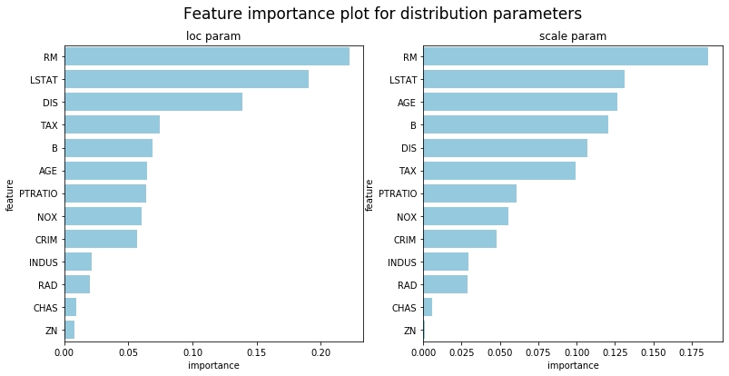
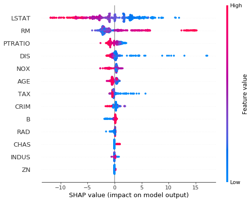
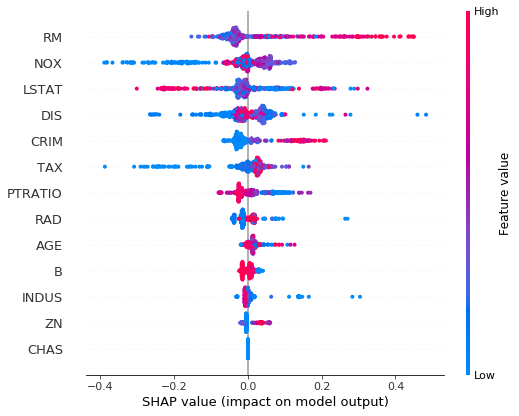

### NGBoost: Natural Gradient Boosting for Probabilistic Prediction

ngboost is a Python library that implements Natural Gradient Boosting, as described in ["NGBoost: Natural Gradient Boosting for Probabilistic Prediction"](https://stanfordmlgroup.github.io/projects/ngboost/). It is built on top of [Scikit-Learn](https://scikit-learn.org/stable/), and is designed to be scalable and modular with respect to choice of proper scoring rule, distribution, and base learners.


Installation:

```
pip install --upgrade git+https://github.com/stanfordmlgroup/ngboost.git
```

Probabilistic regression example on the Boston housing dataset:

```python
from ngboost import NGBRegressor

from sklearn.datasets import load_boston
from sklearn.model_selection import train_test_split
from sklearn.metrics import mean_squared_error


X, Y = load_boston(True)
X_train, X_test, Y_train, Y_test = train_test_split(X, Y, test_size=0.2)

ngb = NGBRegressor().fit(X_train, Y_train)
Y_preds = ngb.predict(X_test)
Y_dists = ngb.pred_dist(X_test)

# test Mean Squared Error
test_MSE = mean_squared_error(Y_preds, Y_test)
print('Test MSE', test_MSE)

# test Negative Log Likelihood
test_NLL = -Y_dists.logpdf(Y_test.flatten()).mean()
print('Test NLL', test_NLL)
```

## Interpretable ML

ngboost provides methods to interpret the models(right now it supports `default_tree_learner` only). Notice that each parameter in the distribution is fitted by a separate learner, so there will be multiple model interpretation results, one for each parameter. The default distribution used is normal distribution, so in the following example it is showing results for (`loc`, `scale`) parameters.


### [ Feature Importance](./examples/model_interpretation/Feature_importance.ipynb)


```python
## Feature importance for loc trees
feature_importance_loc = ngb.feature_importances_[0]

## Feature importance for scale trees
feature_importance_scale = ngb.feature_importances_[1]

df_loc = pd.DataFrame({'feature':load_boston()['feature_names'], 
                       'importance':feature_importance_loc})\
    .sort_values('importance',ascending=False)
df_scale = pd.DataFrame({'feature':load_boston()['feature_names'], 
                       'importance':feature_importance_scale})\
    .sort_values('importance',ascending=False)

fig, (ax1, ax2) = plt.subplots(1, 2, figsize=(13,6))
fig.suptitle("Feature importance plot for distribution parameters", fontsize=17)
sns.barplot(x='importance',y='feature',ax=ax1,data=df_loc, color="skyblue").set_title('loc param')
sns.barplot(x='importance',y='feature',ax=ax2,data=df_scale, color="skyblue").set_title('scale param')
```



### [Feature contribution(SHAP plots)](./examples/model_interpretation/SHAP_plots.ipynb)

```python
import shap
shap.initjs()
```

```python
## SHAP plot for loc trees
explainer = shap.TreeExplainer(ngb, model_output=0)
shap_values = explainer.shap_values(X)
shap.summary_plot(shap_values, X, feature_names=load_boston()['feature_names'])
```

```python
## SHAP plot for scale trees
explainer = shap.TreeExplainer(ngb, model_output=1)
shap_values = explainer.shap_values(X)
shap.summary_plot(shap_values, X, feature_names=load_boston()['feature_names'])
```


